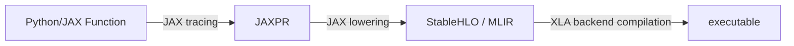
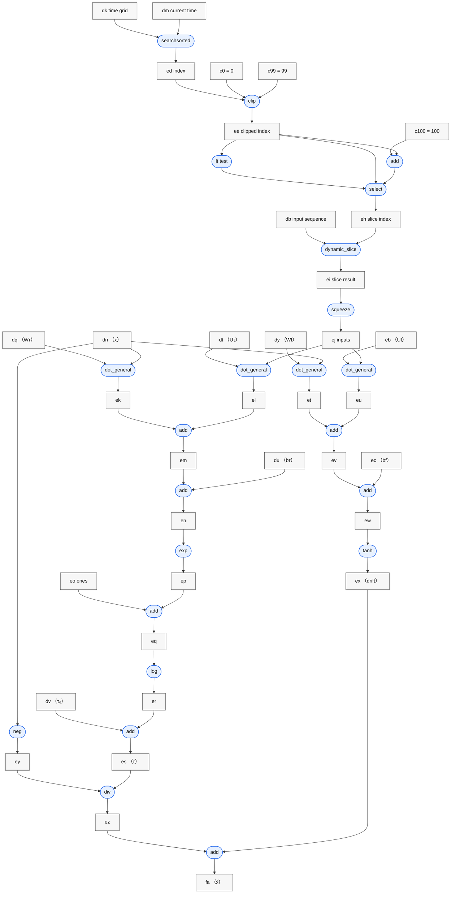
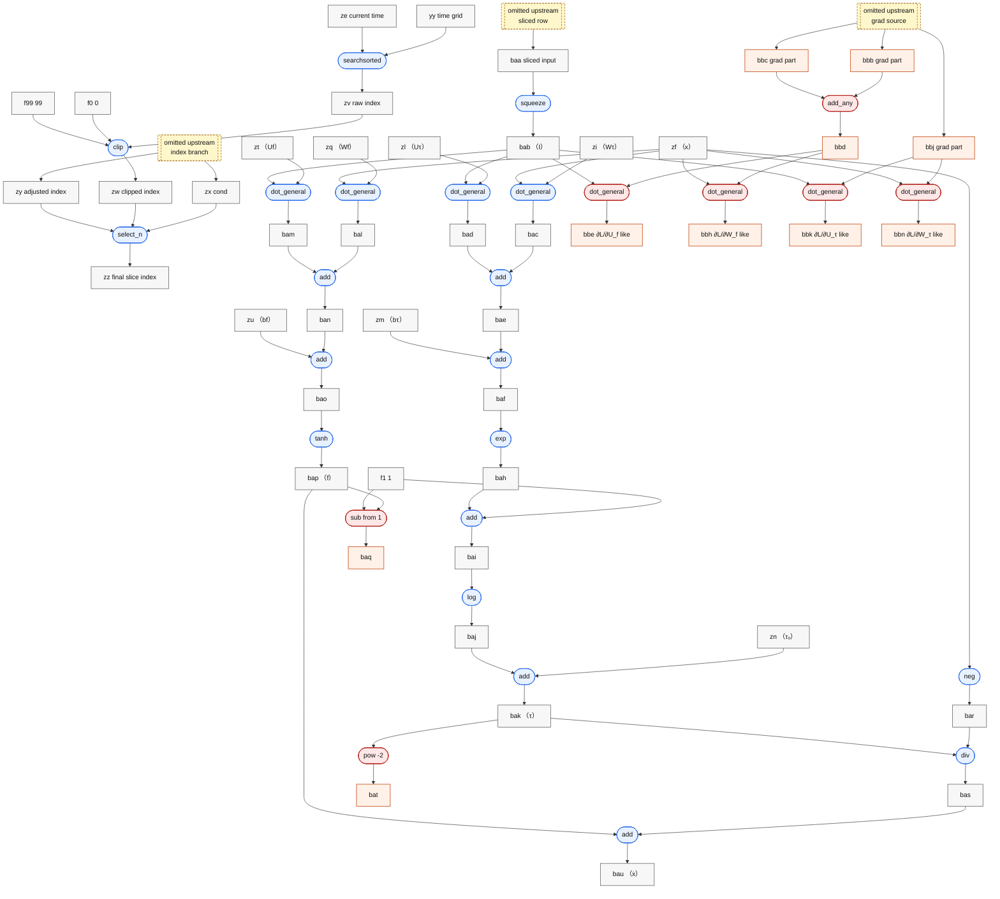
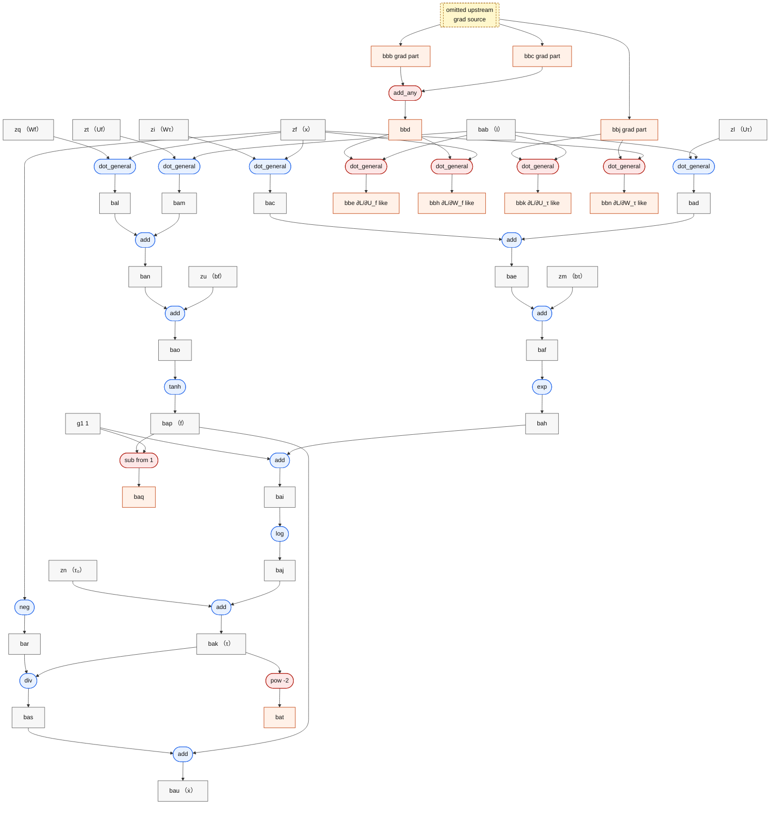

# JAX LTC Compilation and Automatic Differentiation Analysis

## Before We Begin: Similarities and Differences Between the JAX and Julia Versions

Before getting into JAXPR, StableHLO, and profiling, it is worth clarifying the scope of comparison in this post. The JAX version in this repository is not an arbitrary rewrite; it is a port designed to stay as close as possible to the Julia reference implementation. That said, the two versions are not identical at the lower-system level.

The main similarities are:

- They use the same LTC dynamics definition:

$$
\tau(x, I) = \tau_0 + \mathrm{softplus}(W_\tau x + U_\tau I + b_\tau)
$$

$$
f(x, I) = \tanh(W_f x + U_f I + b_f)
$$

$$
\frac{dx}{dt} = -\frac{x}{\tau(x, I)} + f(x, I)
$$

- The parameter layout, `flatten / unflatten` order, hidden dimension, and input dimension are kept aligned with the Julia version as closely as possible.
- The training task, dataset split, loss function, and main hyperparameters are also aligned, such as `EPOCHS = 300`, `HIDDEN_DIM = 8`, `LR = 1e-3`, and `GRAD_CLIP = 1.0`.
- At the optimizer level, both sides use the same hand-written Adam logic rather than relying on high-level optimizer wrappers from their respective ecosystems.

The main differences are:

- The Julia version builds its forward solve on `DifferentialEquations.jl`, currently using `Tsit5()`, and differentiates through it via `Zygote + SciMLSensitivity`.
- The JAX version currently uses `jax.experimental.ode.odeint` for the forward solve, uses `jax.value_and_grad` during training, and explicitly hands `train_step` to `jax.jit` / XLA for compilation.
- As a result, the JAX version naturally exposes the `Python/JAX -> JAXPR -> StableHLO -> XLA executable` compilation path, while the Julia version more naturally corresponds to `Julia code -> Zygote/SciMLSensitivity -> LLVM/native code`.

This also means that this post is not mainly about which side is numerically more accurate in absolute terms, or which solver is “better.” Since the solver stack, AD stack, and compilation stack are not identical, absolute timing and absolute numerical values must be interpreted with care.

What this post actually focuses on is this: under a setting where model definition and training setup are aligned as much as possible, how does JAX represent, differentiate, and compile a continuous-time differentiable program?

## 1. The JAX Compilation and Automatic Differentiation Pipeline

This project is mainly about comparing JAX’s compilation and AD path for the LTC training loop.

This section does not compare the numerical results of the JAX and Julia methods directly. Numerical differences largely come from concrete algorithmic choices such as numerical integrators. The forward numerical computation itself is only weakly comparable across frameworks. What we care about here is how JAX handles a continuous-time differentiable program.

In JAX, the LTC training process is not executed step by step by the Python interpreter. Instead, Python/JAX functions are first represented as JAXPR, then lowered to StableHLO, and finally compiled by XLA.

### Execution Stages

#### Python/JAX Function -> JAXPR

This step is mainly handled by JAX’s own tracing mechanism.

- The user first writes a Python/JAX function.
- When `jax.jit`, `jax.grad`, `jax.make_jaxpr`, and similar APIs are invoked,
- JAX runs the function once with tracer values,
- and during this process it records primitives, shapes, dtypes, and the dataflow and control-flow structure.

#### JAXPR -> StableHLO

The transformation from JAXPR to StableHLO is mainly performed by JAX lowering. In other words, high-level primitives in JAXPR are translated, through their lowering rules, into StableHLO/MLIR that is closer to compiler input.

#### StableHLO -> Compiled Executable

This step is mainly the responsibility of the XLA/backend compiler. XLA takes StableHLO/HLO as input and generates a final executable for the target backend.

The final artifact depends on the backend:

- On CPU backends, it will typically go further down through LLVM.
- On GPU or TPU backends, it will go through their own backend-specific code generation paths.

This post does not analyze the compiled executable stage, because that layer is already highly dependent on the specific backend and its code generation details. Going further down into LLVM IR or assembly would shift the focus from “how JAX compiles and differentiates a continuous-time program” to “how a particular CPU/GPU/TPU backend emits machine code.” For this article, JAXPR, StableHLO, and train-step timing are already sufficient to support the main argument.

Concretely, in this project this pipeline corresponds to:

1. Defining the LTC forward rollout, loss, and train step in Python/JAX.
2. JAX converting these functions into JAXPR while preserving program semantics and AD structure.
3. JAX lowering that representation into StableHLO, which is closer to compiler input.
4. XLA compiling StableHLO into a final executable.



## 2. A More Concrete Example: `ltc_dynamics`

We start with a concrete sub-process: `ltc_dynamics`.

The corresponding source appears at [jax_ltc.py#L105](../code/jax/jax_ltc.py#L105), [jax_ltc.py#L111](../code/jax/jax_ltc.py#L111), and [jax_ltc.py#L117](../code/jax/jax_ltc.py#L117):

```python
def tau(cell, x, inputs):
    return cell.tau0 + softplus(cell.W_tau @ x + cell.U_tau @ inputs + cell.b_tau)

def f_drift(cell, x, inputs):
    return jnp.tanh(cell.W_f @ x + cell.U_f @ inputs + cell.b_f)

def ltc_dynamics(x, cell, inputs):
    tau_val = tau(cell, x, inputs)
    f_val = f_drift(cell, x, inputs)
    return -x / tau_val + f_val
```

If we write the logic more compactly:

```python
tau(x, I) = tau0 + softplus(W_tau @ x + U_tau @ I + b_tau)
f(x, I) = tanh(W_f @ x + U_f @ I + b_f)
dx/dt = -x / tau(x, I) + f(x, I)
```

In equation form:

$$
\tau(x, I) = \tau_0 + \mathrm{softplus}(W_\tau x + U_\tau I + b_\tau)
$$

$$
\mathrm{softplus}(z) = \log(1 + e^z)
$$

$$
f(x, I) = \tanh(W_f x + U_f I + b_f)
$$

$$
\frac{dx}{dt} = -\frac{x}{\tau(x, I)} + f(x, I)
$$

The final equation can also be fully expanded into one line:

$$
\frac{dx}{dt}=
-\frac{x}{\tau_0 + \mathrm{softplus}(W_\tau x + U_\tau I + b_\tau)}
+
\tanh(W_f x + U_f I + b_f)
$$

The corresponding key fragment in JAXPR appears in [rollout.txt#L203](../results_jax/jaxpr_zeta0p3/rollout.txt#L203) to [rollout.txt#L242](../results_jax/jaxpr_zeta0p3/rollout.txt#L242). A representative excerpt is:

```text
ed:i32[] = pjit[name=searchsorted jaxpr=searchsorted] dk dm
ee:i32[] = pjit[name=clip jaxpr=clip] ed 0:i32[] 99:i32[]
ei:f32[1,2] = dynamic_slice[slice_sizes=(1, 2)] db eh 0:i32[]
ej:f32[2] = squeeze[dimensions=(0,)] ei

ek:f32[8] = dot_general[...] dq dn
el:f32[8] = dot_general[...] dt ej
em:f32[8] = add ek el
en:f32[8] = add em du
ep:f32[8] = exp en
eq:f32[8] = add eo ep
er:f32[8] = log eq
es:f32[8] = add dv er

et:f32[8] = dot_general[...] dy dn
eu:f32[8] = dot_general[...] eb ej
ev:f32[8] = add et eu
ew:f32[8] = add ev ec
ex:f32[8] = tanh ew

ey:f32[8] = neg dn
ez:f32[8] = div ey es
fa:f32[8] = add ez ex
```

The dataflow of this JAXPR fragment can be illustrated as follows.

The node names keep the original JAXPR intermediate variable names; the correspondence to the original mathematical symbols is given in the table below.



The main variables correspond as follows:

| JAXPR variable | Original symbol in the equations | Meaning |
| --- | --- | --- |
| `dk` | $t_{\mathrm{grid}}$ | The input-sequence time grid `t_grid` |
| `dm` | $t$ | The current time at which the derivative is being queried |
| `ed` | - | The raw insertion position returned by `searchsorted(t_grid, t)` |
| `c0` | $0$ | Lower bound used by `clip` |
| `c99` | $99$ | Upper bound used by `clip`; here the training split has length 100, so the largest valid index is 99 |
| `ee` | - | Valid index after `clip(ed, 0, 99)` |
| `c100` | $100$ | Constant used for index correction; i.e. the sequence length |
| `eh` | - | Final slice index after conditional selection |
| `dn` | $x$ | Current hidden state |
| `ej` | $I$ | Current input |
| `dq` | $W_\tau$ | State weight in the `tau` branch |
| `dt` | $U_\tau$ | Input weight in the `tau` branch |
| `du` | $b_\tau$ | Bias in the `tau` branch |
| `dv` | $\tau_0$ | Base time constant |
| `dy` | $W_f$ | State weight in the `drift` branch |
| `eb` | $U_f$ | Input weight in the `drift` branch |
| `ec` | $b_f$ | Bias in the `drift` branch |
| `es` | $\tau(x, I)$ | Dynamic time constant |
| `ex` | $f(x, I)$ | Drift term |
| `fa` | $\frac{dx}{dt}$ | Final derivative output |

If the indexing-related part feels confusing from variable names alone, it can be read more directly as:

- `dk`
  - the time axis `t_grid` of the input sequence
- `dm`
  - the current time `t` being queried by the ODE solver
- `ed`
  - the result of `searchsorted(t_grid, t)`, i.e. “which position of the input sequence corresponds to the current time”
- `c0`, `c99`
  - the lower and upper bounds used by `clip` to avoid out-of-bounds indices
- `ee`
  - the clipped valid index
- `lt test`
  - a boolean test that checks whether the index needs further correction in the internal representation
- `c100`
  - a sequence-length constant; in the diagram this corresponds to preparing an alternative `ee + 100`
- `select`
  - chooses between `ee` and the corrected index according to the previous boolean condition, producing `eh`
- `eh`
  - the final slice index actually fed into `dynamic_slice`

What can be seen here is:

- `searchsorted -> clip -> dynamic_slice`
  - corresponds to fetching `inputs` from the input sequence according to the current time
- `dot_general + add + exp + log`
  - corresponds to the `softplus` inside `tau(cell, x, inputs)`
- `dot_general + add + tanh`
  - corresponds to `f_drift(cell, x, inputs)`
- `neg + div + add`
  - corresponds to the final `-x / tau_val + f_val`

In other words, in JAXPR, high-level source expressions such as `softplus`, `tanh`, and `-x / tau + f` have already been decomposed into primitive-level operations.

The same process can also be matched in StableHLO. The corresponding fragment appears in [rollout.mlir#L55](../results_jax/hlo_zeta0p3/rollout.mlir#L55) to [rollout.mlir#L83](../results_jax/hlo_zeta0p3/rollout.mlir#L83). A representative excerpt is:

```mlir
%18 = call @searchsorted(%arg3, %1) : (tensor<100xf32>, tensor<f32>) -> tensor<i32>
%19 = call @clip(%18, %c, %c_5) : (tensor<i32>, tensor<i32>, tensor<i32>) -> tensor<i32>
%23 = stablehlo.dynamic_slice %cst, %22, %c_6, sizes = [1, 2]
%24 = stablehlo.reshape %23 : (tensor<1x2xf32>) -> tensor<2xf32>

%25 = stablehlo.dot_general %5, %2, contracting_dims = [1] x [0]
%26 = stablehlo.dot_general %8, %24, contracting_dims = [1] x [0]
%27 = stablehlo.add %25, %26 : tensor<8xf32>
%28 = stablehlo.add %27, %9 : tensor<8xf32>
%30 = stablehlo.exponential %28 : tensor<8xf32>
%31 = stablehlo.add %29, %30 : tensor<8xf32>
%32 = stablehlo.log %31 : tensor<8xf32>
%33 = stablehlo.add %10, %32 : tensor<8xf32>

%34 = stablehlo.dot_general %13, %2, contracting_dims = [1] x [0]
%35 = stablehlo.dot_general %16, %24, contracting_dims = [1] x [0]
%37 = stablehlo.add %36, %17 : tensor<8xf32>
%38 = stablehlo.tanh %37 : tensor<8xf32>
%39 = stablehlo.negate %2 : tensor<8xf32>
%40 = stablehlo.divide %39, %33 : tensor<8xf32>
%41 = stablehlo.add %40, %38 : tensor<8xf32>
```

Here we can see:

- `call @searchsorted`
- `stablehlo.dynamic_slice`
- `stablehlo.dot_general`
- `stablehlo.exponential`
- `stablehlo.log`
- `stablehlo.tanh`
- `stablehlo.negate`
- `stablehlo.divide`
- `stablehlo.add`

So the value of StableHLO is not that it simply restates the mathematical formula. Rather, it shows that these high-level primitives have already been lowered into control flow, function calls, and linear algebra operations that the compiler can actually process.

### 2.1 What Happens to the Same Example After AD?

Up to this point, the example has only shown how the forward pass is lowered. But training is what we actually care about here, so we also need to see what the same `ltc_dynamics` logic looks like after automatic differentiation.

Instead of extracting a few scattered operations, it is more useful to grab a sub-process with clear boundaries. Here we focus on the core of `ltc_dynamics`:

$$
\tau(x, I)=\tau_0 + \log\bigl(1 + e^{W_\tau x + U_\tau I + b_\tau}\bigr)
$$

$$
f(x, I)=\tanh(W_f x + U_f I + b_f)
$$

$$
\frac{dx}{dt} = -\frac{x}{\tau(x, I)} + f(x, I)
$$

In the `grad` JAXPR, what corresponds to this is not the entire training graph, but a relatively complete local subgraph formed by these three equations after automatic differentiation. The relevant region appears in [grad.txt#L1228](../results_jax/jaxpr_zeta0p3/grad.txt#L1228) to [grad.txt#L1313](../results_jax/jaxpr_zeta0p3/grad.txt#L1313):

```text
zv:i32[] = pjit[name=searchsorted ...] yy ze
zw:i32[] = pjit[name=clip ...] zv 0:i32[] 99:i32[]
zz:i32[] = select_n zx zw zy
bab:f32[2] = squeeze[...] baa

bac:f32[8] = dot_general[...] zi zf
bad:f32[8] = dot_general[...] zl bab
bae:f32[8] = add bac bad
baf:f32[8] = add bae zm
bah:f32[8] = exp baf
baj:f32[8] = log bai
bak:f32[8] = add zn baj

bal:f32[8] = dot_general[...] zq zf
bam:f32[8] = dot_general[...] zt bab
ban:f32[8] = add bal bam
bao:f32[8] = add ban zu
bap:f32[8] = tanh bao

bar:f32[8] = neg zf
bas:f32[8] = div bar bak
bau:f32[8] = add bas bap

baq:f32[8] = sub 1.0:f32[] bap
bat:f32[8] = integer_pow[y=-2] bak
bbd:f32[8] = add_any bbb bbc
bbe:f32[8,2] = dot_general[...] bbd bab
bbh:f32[8,8] = dot_general[...] bbd zf
bbk:f32[8,2] = dot_general[...] bbj bab
bbn:f32[8,8] = dot_general[...] bbj zf
```

The following “more complete local graph” is closer to the original `grad` JAXPR fragment. It keeps the small segment that maps from time index to current input `I`, so it is more faithful to the original IR:



The role of this more complete local graph is to first show the reader that the `ltc_dynamics` fragment does not appear in isolation inside the `grad` JAXPR. It is still embedded inside a larger flow: fetch input according to time, do the forward computation, then connect to the backward pass.

If we crop that local backward graph into a more focused version, keeping only `tau`, `drift`, $\frac{dx}{dt}$, and the most important backward quantities, we get:



The variables in the diagram can be translated back into equation-level symbols as follows. The final column explicitly marks whether each quantity mainly belongs to the forward residue or to newly introduced backward structure.

| JAXPR variable | Symbol in the equations | Meaning | Forward / Backward |
| --- | --- | --- | --- |
| `yy` | $t_{\mathrm{grid}}$ | Input-sequence time grid | Forward residue |
| `ze` | $t$ | Current solve time | Forward residue |
| `zv` | - | Raw index from `searchsorted` | Forward residue |
| `zw` | - | Valid index after `clip` | Forward residue |
| `zz` | - | Final slice index | Forward residue |
| `bab` | $I$ | Current input | Forward residue |
| `zf` | $x$ | Current hidden state | Forward residue |
| `zi` | $W_\tau$ | State weight in the `tau` branch | Forward residue |
| `zl` | $U_\tau$ | Input weight in the `tau` branch | Forward residue |
| `zm` | $b_\tau$ | Bias in the `tau` branch | Forward residue |
| `zn` | $\tau_0$ | Base time constant | Forward residue |
| `bak` | $\tau(x, I)$ | Dynamic time constant | Forward residue |
| `zq` | $W_f$ | State weight in the `drift` branch | Forward residue |
| `zt` | $U_f$ | Input weight in the `drift` branch | Forward residue |
| `zu` | $b_f$ | Bias in the `drift` branch | Forward residue |
| `bap` | $f(x, I)$ | Drift term | Forward residue |
| `bau` | $\frac{dx}{dt}$ | Dynamics right-hand-side output | Forward residue |
| `baq` | $1 - \tanh^2(u)$ | Local derivative term for the `tanh` branch | Backward-added |
| `bat` | $\tau(x, I)^{-2}$ | Derivative term for division / reciprocal square | Backward-added |
| `bbb`, `bbc`, `bbd` | - | Intermediate values after local gradient accumulation | Backward-added |
| `bbe` | $\frac{\partial L}{\partial U_f}$ local block | Gradient block for `U_f` | Backward-added |
| `bbh` | $\frac{\partial L}{\partial W_f}$ local block | Gradient block for `W_f` | Backward-added |
| `bbk` | $\frac{\partial L}{\partial U_\tau}$ local block | Gradient block for `U_\tau` | Backward-added |
| `bbn` | $\frac{\partial L}{\partial W_\tau}$ local block | Gradient block for `W_\tau` | Backward-added |

This simplified diagram intentionally removes the “how do we retrieve the current input `I` from time `t`?” portion and keeps only `ltc_dynamics` itself plus its most important backward structure.

The yellow dashed box indicates upstream gradient sources that are not expanded in this figure. The point is that this is not a complete backward graph; it is a local analysis diagram organized around the three core `ltc_dynamics` equations, containing forward residue plus the most important backward quantities.

The color convention is:

- gray / blue
  - forward-residue values and operations
- orange / red
  - values and operations newly introduced by the backward pass
- yellow dashed box
  - upstream inputs omitted from this local figure; they are not disconnected, they come from elsewhere in the larger `grad` graph

The graph can be read in the following order:

1. Start from `bab (I)` and `zf (x)`.
2. The left half computes `bak (\tau)`, i.e. the dynamic time-constant branch.
3. The right half computes `bap (f)`, i.e. the `drift` branch.
4. The middle `neg -> div -> add` path produces `bau (ẋ)`, corresponding to

$$
\frac{dx}{dt} = -\frac{x}{\tau(x, I)} + f(x, I)
$$

5. Up to this point, the gray/blue region is still forward residue.
6. Starting from `baq` and `bat`, the graph enters the orange/red region, where local derivative terms appear explicitly, e.g.

$$
1 - \tanh^2(u), \qquad \tau(x, I)^{-2}
$$

7. Finally, `bbe`, `bbh`, `bbk`, and `bbn` represent gradients being propagated back to parameter matrices, corresponding to local gradient blocks for $U_f$, $W_f$, $U_\tau$, and $W_\tau$.

At the level of actual derivatives, the most important formulas represented by this backward fragment are:

First define

$$
u = W_f x + U_f I + b_f, \qquad f(x, I) = \tanh(u)
$$

and

$$
v = W_\tau x + U_\tau I + b_\tau, \qquad \tau(x, I) = \tau_0 + \log(1 + e^v)
$$

Then the JAXPR quantities

- `baq = 1 - bap`
- `bat = integer_pow[y=-2] bak`

correspond to:

$$
1 - f(x, I)^2 = 1 - \tanh^2(u)
$$

and

$$
\tau(x, I)^{-2} = \frac{1}{\tau(x, I)^2}
$$

Now consider the main forward expression

$$
g(x, I) = \frac{dx}{dt} = -\frac{x}{\tau(x, I)} + f(x, I)
$$

Its local derivatives with respect to several key intermediate quantities are:

$$
\frac{\partial g}{\partial f} = 1
$$

$$
\frac{\partial g}{\partial x}\Big|_{\tau\ \text{fixed}} = -\frac{1}{\tau(x, I)}
$$

$$
\frac{\partial g}{\partial \tau} = \frac{x}{\tau(x, I)^2}
$$

This last term is exactly why combinations such as `neg`, `div`, and `integer_pow[y=-2]` appear in the backward graph: together they form a local derivative of the form

$$
\frac{x}{\tau^2}
$$

One layer further back, the chain rule for the `tanh` branch and the `softplus/log(1+e^v)` branch gives:

$$
\frac{\partial g}{\partial u}=\frac{\partial g}{\partial f}\cdot \frac{\partial f}{\partial u}=1 \cdot \left(1-\tanh^2(u)\right)
$$

$$
\frac{\partial g}{\partial v}=\frac{\partial g}{\partial \tau}\cdot \frac{\partial \tau}{\partial v}=
\frac{x}{\tau(x, I)^2}\cdot \frac{e^v}{1+e^v}
$$

This is also why the same JAXPR fragment simultaneously contains:

- `exp` / `log`
- `tanh`
- `sub 1 - tanh(...)`
- `integer_pow[y=-2]`
- and a subsequent series of `dot_general`

By this point the graph is no longer performing just forward evaluation. It is explicitly constructing these chain-rule derivatives and propagating gradients back into $W_\tau, U_\tau, b_\tau, W_f, U_f, b_f$.

Beyond the differentiation itself, several other characteristic structures appear.

The first is local derivatives for nonlinearities and division:

- `sub 1.0 - tanh(...)`
- `integer_pow[y=-2]`
- more `mul` and `div`

This indicates that the backward graph is explicitly constructing:

- derivative-related terms of `tanh`
- derivative-related terms such as `1 / tau` and `1 / tau^2`

The second is parameter-gradient backpropagation:

- additional `dot_general`
- many `transpose`

These correspond to sending state gradients back into:

- `W_tau`
- `U_tau`
- `W_f`
- `U_f`

The third is parameter packing:

- `add_any`
- `pad`

This is especially important here because the parameters in this project are flattened into a vector of length `184`.

So the backward graph does not only compute local gradients; it also repacks gradient blocks of different parameter groups back into that flattened vector.

In other words, after AD, JAXPR contains much more than the forward pass: a forward subgraph, local-derivative computation, parameter-gradient propagation, and flattened-parameter-vector reassembly.

The corresponding StableHLO fragment in [grad.mlir#L1419](../results_jax/hlo_zeta0p3/grad.mlir#L1419) to [grad.mlir#L1482](../results_jax/hlo_zeta0p3/grad.mlir#L1482) shows the same phenomenon:

```mlir
%51 = stablehlo.dot_general %31, %28, contracting_dims = [1] x [0]
%52 = stablehlo.dot_general %34, %50, contracting_dims = [1] x [0]
%56 = stablehlo.exponential %54 : tensor<8xf32>
%58 = stablehlo.log %57 : tensor<8xf32>
%64 = stablehlo.tanh %63 : tensor<8xf32>
%66 = stablehlo.subtract %65, %64 : tensor<8xf32>
%68 = stablehlo.divide %67, %59 : tensor<8xf32>
%71 = stablehlo.divide %70, %69 : tensor<8xf32>

%82 = stablehlo.dot_general %81, %50, contracting_dims = [] x []
%83 = stablehlo.dot_general %81, %39, contracting_dims = [0] x [0]
%85 = stablehlo.dot_general %81, %28, contracting_dims = [] x []

%92 = stablehlo.pad %81, %cst_7, low = [176], high = [0], interior = [0]
%95 = stablehlo.pad %94, %cst_7, low = [160], high = [8], interior = [0]
%99 = stablehlo.pad %98, %cst_7, low = [96], high = [24], interior = [0]
%101 = stablehlo.pad %76, %cst_7, low = [88], high = [88], interior = [0]
%103 = stablehlo.pad %87, %cst_7, low = [80], high = [96], interior = [0]
%107 = stablehlo.pad %106, %cst_7, low = [64], high = [104], interior = [0]
%111 = stablehlo.pad %110, %cst_7, low = [0], high = [120], interior = [0]
```

This shows that at the compiler layer, the AD-transformed program is no longer just the forward operators. It has already become a program containing:

- operators needed to reconstruct forward values
- local backward derivatives
- matrix outer-product style weight gradients
- gradient concatenation and reordering

Therefore, in LTC training, automatic differentiation is not simply “taking a gradient of the forward result.” It expands the same continuous-time dynamics into a larger program containing local derivatives, parameter-gradient propagation, and gradient reassembly. This is why the JAXPR and StableHLO of `grad` are substantially larger than those of `rollout`.

## 3. Global Analysis

The first two sections focused on the local example of `ltc_dynamics`, examining how a small piece of continuous-time dynamics expands in the forward and backward pass. In this section, we zoom back out. Rather than staring at one local subgraph, we analyze what the whole LTC training process looks like at the JAXPR and StableHLO levels.

We use the most complete set of artifacts currently available, namely the `zeta = 0.3` experiment.

Before getting into JAXPR and StableHLO, one subtle but important point about continuous-time models should be made clear.

For models such as Neural ODEs or LTCs, the core definition is:

$$
\frac{dz}{dt} = f_\theta(z, t, I)
$$

Here the “differential” is first and foremost part of the model definition; it is not the result of automatic differentiation. In other words, the network outputs a state derivative. The forward pass then does not directly read off the next layer; it integrates that derivative over time to obtain the full state trajectory $z(t)$.

So the most immediate implementation difference between a continuous-time model and a standard discrete network is:

- forward stage
  - requires ODE solving / numerical integration
- training stage
  - requires differentiating the loss after integration to obtain parameter gradients

Therefore, the focus of the remaining analysis is this: the model first defines continuous-time dynamics in the forward sense, and then automatic differentiation is asked to pass through that forward integration process during training.

That is also why, at the JAXPR and StableHLO levels, we do not simply see an ordinary stacked network. We instead see `scan`, `while`, solver calls, and a more complex backward-pass structure.

### 3.1 JAXPR View: From Forward Program to AD Program

According to [results_jax/jaxpr_zeta0p3/summary.json](../results_jax/jaxpr_zeta0p3/summary.json):

- `rollout.top_level_eqns = 4`
  - at the outermost level, the `rollout` JAXPR contains only 4 “large steps”
- `loss.top_level_eqns = 9`
  - `loss` adds readout and MSE-related operations on top of `rollout`
- `grad.top_level_eqns = 16`
  - `grad` adds one more layer of AD wrapper and gradient structure at the top level
- `train_step.top_level_eqns = 42`
  - `train_step` further includes gradient clipping, Adam updates, and state returns, so the top level becomes larger

There is also a clear containment relation among these four objects:

- `rollout`
  - only performs forward integration and returns the hidden-state trajectory
- `loss`
  - adds readout and MSE on top of `rollout`
- `grad`
  - differentiates the `loss` with respect to parameters
- `train_step`
  - adds gradient clipping, Adam updates, and optimizer-state advancement on top of `grad`

So the relationship is closer to:

$$
\texttt{rollout}
\subset
\texttt{loss}
\subset
\texttt{grad}
\subset
\texttt{train\_step}
$$

In terms of primitive statistics, JAXPR is particularly useful for looking at:

- `custom_vjp_call`
- `scan`
- `while`
- `dot_general`
- `dynamic_slice`
- `tanh`
- `exp`
- `log`

Several of these primitives are especially worth discussing, because they reveal the difference between a continuous-time program and a standard feedforward network.

- `scan`
  - can be understood as a state-carrying sequential scan / fixed-structure loop
  - it is suitable for representing repeated execution of the same computation over a known sequence of timesteps or intermediate states, while carrying state from one step to the next
  - in this project, the appearance of `scan` shows that the graph contains explicit time-stepping or stepwise accumulation, rather than a one-shot static forward computation
  - for example, even `searchsorted` internally contains a `scan`:

```text
_:i32[] c:i32[] = scan[
  _split_transpose=False
  jaxpr={ lambda ; d:f32[100] e:f32[] f:i32[] g:i32[]. let
      ...
```

- `while`
  - can be understood as a loop with a termination condition / a loop whose stopping time is not known in advance
  - unlike `scan`, `while` emphasizes that the loop continues or stops depending on a condition rather than simply sweeping through a fixed sequence
  - in the LTC example, `while` is closer to the kind of loop that appears inside an ODE solver: step, check, and then decide whether to continue
  - for example, inside a deeper subgraph of `rollout`, a `while` appears nested under a `scan`:

```text
_:f32[8] ... ik:f32[99,8] = scan[
  ...
  _:i32[] ja:f32[8] jb:f32[8] ... = while[
    body_jaxpr={ lambda ; ... }
```

- difference between `scan` and `while`
  - `scan` is closer to “I know I need to repeat the same kind of computation over a sequence of elements / timesteps”
  - `while` is closer to “I enter the loop, and whether I stop depends on a condition”
  - therefore, `scan` is more like structured traversal, while `while` is more like a condition-driven loop inside control flow or a solver
  - in more informal terms:
    - `scan` is closer to a fixed-structure loop
    - `while` is closer to a loop whose end time is not known in advance
  - the “uncertainty” here means that the stopping time depends on a runtime condition; it does not mean the loop cannot enter the computation graph. JAX handles this by representing both the `cond_jaxpr` and `body_jaxpr` of the `while`, so the control flow itself remains part of the program representation even if the actual number of iterations depends on runtime state

- `custom_vjp_call`
  - indicates that the call is not an ordinary bare function call, but a function with a custom backward rule
  - in this project, this is essentially the key trace left by the `odeint` layer: the forward pass solves the ODE, while the backward pass does not mechanically unroll the solver but instead uses the VJP rule defined for that function
  - for example:

```text
da:f32[100,8] = custom_vjp_call[
  name=_odeint
  bwd=_odeint_rev
  call_jaxpr={ lambda ; ... }
```

- `dynamic_slice`
  - indicates that the slice position is not fixed at compile time, but computed at runtime and then used for slicing
  - in this project, it corresponds to “find the current position in `t_grid` from the current time, then fetch the current `I` from the input sequence”
  - so this is not ordinary static indexing; it is direct evidence that time-indexing logic has entered the computation graph
  - for example:

```text
ed:i32[] = pjit[name=searchsorted jaxpr=searchsorted] dk dm
ee:i32[] = pjit[name=clip jaxpr=clip] ed 0:i32[] 99:i32[]
eh:i32[] = select_n ef ee eg
ei:f32[1,2] = dynamic_slice[slice_sizes=(1, 2)] db eh 0:i32[]
```

In [rollout.txt](../results_jax/jaxpr_zeta0p3/rollout.txt), we can see:

- `dot_general`
- `tanh`
- `exp` / `log`
- `dynamic_slice`
- `scan`
- `while`

These structures show that even if we only look at the forward rollout, JAX is not handling a simple static network. It is handling:

- neural-network right-hand-side computation
- a mapping from time index to input sequence
- loop structures associated with ODE solving

In [grad.txt](../results_jax/jaxpr_zeta0p3/grad.txt), these structures expand substantially. According to [summary.json](../results_jax/jaxpr_zeta0p3/summary.json):

- `dot_general: 16 -> 55`
- `transpose: 12 -> 40`
- `scan: 6 -> 14`
- `while: 1 -> 2`
- `tanh: 3 -> 7`

These numbers grow not simply because “the graph got longer,” but because the backward pass genuinely adds new computation structure to the forward program. More concretely:

- `dot_general: 16 -> 55`
  - in the forward pass, `dot_general` mainly corresponds to linear layers such as $W_\tau x$, $U_\tau I$, $W_f x$, and $U_f I$
  - in the backward pass, in addition to preserving these forward multiplications, JAX must also compute:
    - gradient propagation back to the state
    - gradient propagation back to the weights
    - gradient propagation back to the input
  - therefore, a single forward matrix multiplication often gives rise to more matrix multiplications in the backward pass

- `transpose: 12 -> 40`
  - in backpropagation, matrix gradients and vector gradients often require changing dimensions and layouts
  - for example, when converting from “gradient in the state direction” to “gradient in the weight-matrix direction,” `transpose` is often inserted
  - so once `dot_general` grows, `transpose` tends to grow along with it

- `scan: 6 -> 14`
  - the forward pass already contains time-stepping structure
  - after differentiation, JAX not only preserves the original forward scan but also adds:
    - scans for backward propagation along time
    - scans or accumulations for intermediate-state regrouping
  - so the number of `scan`s increases significantly

- `while: 1 -> 2`
  - the forward solver already contains a conditional loop
  - after differentiation, JAX needs to add corresponding auxiliary control flow or backward control flow for such loops
  - so the number of `while`s generally also increases, though here the increase is not as dramatic as for `dot_general`

- `tanh: 3 -> 7`
  - in the forward pass, `tanh` is part of the `drift` branch itself
  - in the backward pass, its derivative must be used explicitly:
    $$
    \frac{d}{du}\tanh(u) = 1 - \tanh^2(u)
    $$
  - so the forward `tanh` does not disappear; instead it brings along more local-derivative computation around it

In other words, `grad` is not just “a tiny gradient module hanging next to the forward graph.” It expands the forward program into: forward residue + local derivatives + gradient propagation + extra propagation over the time structure. This is exactly why, for a continuous-time model such as LTC, the JAXPR after AD is much larger than the forward `rollout`.

### 3.2 StableHLO View: The Structure Seen by the Compiler

By contrast, StableHLO is better suited to showing the structure actually seen by the compiler. According to [results_jax/hlo_zeta0p3/summary.json](../results_jax/hlo_zeta0p3/summary.json):

- `rollout.line_count = 665`
- `grad.line_count = 1599`
- `rollout.while_count = 5`
- `grad.while_count = 11`

The division of labor should again be made clear here: the expansion caused by automatic differentiation is already mainly visible at the JAXPR level. By the time we reach StableHLO, JAX is not “doing AD again”; it is lowering a program that already contains forward and backward structure into a representation that is easier for the compiler to process. Put differently, JAXPR is better suited to answering “what program did AD generate?”, while StableHLO is better suited to answering “what structure does the compiler finally receive?”

In JAXPR, we can still see relatively high-level structure names such as:

- `custom_vjp_call`
- `pjit[name=searchsorted ...]`
- `scan`
- `while`

In [rollout.mlir](../results_jax/hlo_zeta0p3/rollout.mlir), we directly see:

- `stablehlo.while`
- `call @_odeint_wrapper`
- `call @searchsorted`
- `stablehlo.dot_general`
- `stablehlo.tanh`
- `stablehlo.exponential`

In JAXPR we can see `scan`, `while`, and `custom_vjp_call`, but by the time we reach StableHLO these become more explicit compiler structures:

```mlir
%1 = call @_odeint_wrapper(...)
...
%131:17 = stablehlo.while(...)
...
%0:5 = stablehlo.while(...)
```

That is, from JAXPR to StableHLO, high-level structures are translated into a more standardized, more explicit representation that is closer to compiler execution. The compiler does not see “an abstract concept of ODE solving”; it sees explicit function calls and loop structures.

This means that in the compiler’s eyes, LTC forward computation is not an ordinary feedforward graph. It is a program containing control flow, solver calls, time-indexing logic, linear algebra, and nonlinear operations.

According to [summary.json](../results_jax/hlo_zeta0p3/summary.json):

- JAXPR `rollout` has `dot_general = 16`, `scan = 6`, `while = 1`
- JAXPR `grad` has `dot_general = 55`, `scan = 14`, `while = 2`
- StableHLO `rollout` has line count `665`, `while = 5`
- StableHLO `grad` has line count `1599`, `while = 11`

These figures reflect two different layers of “expansion.”

The first layer is the expansion from `rollout` to `grad`.

At the JAXPR level, `dot_general` grows from `16` to `55`, `scan` from `6` to `14`, and `while` from `1` to `2`. This shows that automatic differentiation is not just attaching a tiny module next to the forward graph; it expands the original forward program into a larger differentiable program. In addition to the forward linear layers and time stepping, the backward pass must explicitly introduce local derivatives, weight gradients, state gradients, and extra propagation across the time structure. That is why matrix multiplications, loops, and auxiliary control flow all increase.

The second layer is the expansion from JAXPR to StableHLO.

This increase does not mean another round of AD is happening. Rather, a program that already contains forward and backward structure is being further lowered into a compiler-friendly intermediate representation. High-level primitives, control flow, and tensor semantics therefore become more explicit, appearing as more `while`, `call`, `compare`, `select`, `broadcast_in_dim`, `pad`, and related structures. That is why `rollout` already occupies `665` lines and `5` `while`s at the HLO level, while `grad` further expands to `1599` lines and `11` `while`s.

So these statistics are not merely saying that “the code got longer.” They are showing that the forward program first expands because of automatic differentiation, and is then further made explicit by lowering into compiler IR. What the compiler ultimately receives is not an ordinary feedforward graph, but a differentiable program containing control flow and a solve process.

## 4. Timing Comparison: `no-jit` vs Compiled `train_step`

If we analyze only the IR and ignore timing, the conclusions hang in the air. The key numbers here come from [train_step_timing.json](../results_jax/profile_zeta0p3/train_step_timing.json):

This profiling was collected on the local Apple Silicon `M4` CPU. The absolute timing values are not the main focus of this article, because they are affected by hardware, system load, and runtime environment. What matters more is the relative relationship between these times, i.e. the tradeoff between one-time compilation cost and compiled steady-state execution cost.

- `no-jit` steady-state single step is about `1.820 s`
- `jit` compiled steady-state single step is about `0.019 s`
- `lower + compile` is about `1.92 s`

These three time figures are not measured in the same sense, and they should not be compared by directly adding them side by side:

- `no-jit` steady-state single step
  - means the average execution time of one `train_step` with no compilation at all
- `jit` compiled steady-state single step
  - means the average execution time of one `train_step` after compilation has already finished
- `lower + compile`
  - means the one-time compilation cost, not a cost paid at every step

So `1.92 s` does not mean “it is bigger than the other two put together.” Instead, it means that JAX pays a one-time compilation tax first, and only afterward does the cost per step drop substantially. In this particular run, compiling once costs roughly as much as one eager step, but after compilation the per-step execution time drops from `1.820 s` to `0.019 s`, i.e. by nearly two orders of magnitude.

This shows:

1. JAX’s main one-time cost is concentrated in lowering and compilation.
2. Once the train step has been compiled, steady-state execution becomes much faster.
3. JAX’s performance characteristic is not simply “how fast is one step,” but rather its whole “stage first, then compile and execute” AD path.

So the structural expansion seen in IR is not merely formal. Train-step profiling shows that JAX’s one-time cost is mainly concentrated in lowering and compilation, while the compiled steady-state step is very short. In other words, JAX’s performance characteristics are shaped by its “stage first, then compile and execute” AD path.

## 5. Conclusion

There are three main conclusions in this article.

First, continuous-time models such as LTC expose framework-level differences more clearly, because their training process is not an ordinary static feedforward network, but a differentiable program made of “dynamics definition + forward integration + automatic differentiation.” For precisely that reason, the thing most worth comparing here is not the numerical integrator itself, but how a framework represents, differentiates, and compiles such continuous-time programs.

Second, `JAXPR` and `StableHLO` reveal two different layers of this pipeline. `JAXPR` is better suited to answering “what did automatic differentiation actually expand the original program into?”, which is why we can directly observe structures such as `dot_general`, `scan`, `while`, `dynamic_slice`, and `custom_vjp_call`, as well as the obvious expansion from `rollout` to `grad`. `StableHLO`, by contrast, is better suited to answering “what does the compiler finally receive?”, so its main role is not to perform AD again, but to further lower a program that already contains forward and backward structure into a more explicit representation of control flow, function calls, and tensor operations.

Third, the structural analysis and the timing results are consistent with each other. The current experiment shows that JAX’s main cost is concentrated in one-time lowering and compilation, while the compiled steady-state execution cost is dramatically lower. In other words, JAX’s performance characteristic is not “is a single step the fastest,” but “is it worth paying a compilation tax up front in exchange for substantial speedup afterward?” The absolute times measured on the local Apple Silicon M4 CPU should be treated only as environment-dependent references, but the relative relationship — compilation cost is visible up front, steady-state execution becomes much cheaper afterward — is the more important and more stable conclusion.

For a continuous-time model such as LTC, JAX’s key feature is not any single operator or integrator. It lies in how JAX represents the whole training loop of “forward integration + automatic differentiation” as JAXPR, lowers it to StableHLO, and then trades a one-time compilation cost for lower steady-state execution cost.
